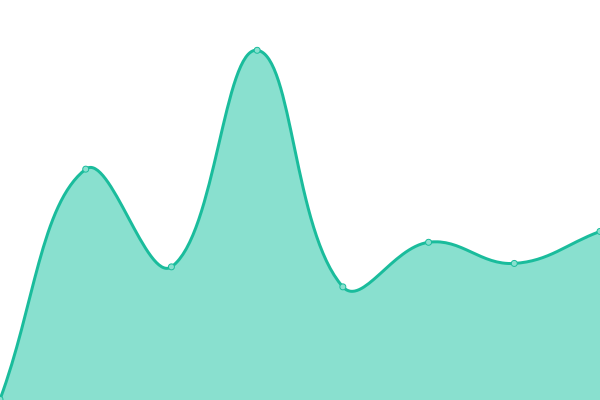

# [📈 Live Status](https://status.dprojects.org): <!--live status--> **🟩 All systems operational**

This repository contains the open-source uptime monitor and status page for [Upptime](https://upptime.js.org), powered by [Upptime](https://github.com/upptime/upptime).

With [Upptime](https://upptime.js.org), you can get your own unlimited and free uptime monitor and status page, powered entirely by a GitHub repository. We use [Issues](https://github.com/upptime/upptime/issues) as incident reports, [Actions](https://github.com/xDoofy92/status/actions) as uptime monitors, and [Pages](https://status.dprojects.org) for the status page.

<!--start: status pages-->
<!-- This summary is generated by Upptime (https://github.com/upptime/upptime) -->
<!-- Do not edit this manually, your changes will be overwritten -->
<!-- prettier-ignore -->
| URL | Status | History | Response Time | Uptime |
| --- | ------ | ------- | ------------- | ------ |
|  [DProjects](https://www.dprojects.org) | 🟩 Up | [d-projects.yml](https://github.com/xDoofy92/status/commits/HEAD/history/d-projects.yml) | 

 761ms
     
 | 

<a href="https://status.xdoofy92.com/history/d-projects">99.81%</a>
    

|  [API DProjects](https://api.dprojects.org/api/ping) | 🟩 Up | [api-d-projects.yml](https://github.com/xDoofy92/status/commits/HEAD/history/api-d-projects.yml) | 

 574ms
     
 | 

<a href="https://status.xdoofy92.com/history/api-d-projects">100.00%</a>
    

|  [xdoofy92](https://xdoofy92.com) | 🟩 Up | [xdoofy92.yml](https://github.com/xDoofy92/status/commits/HEAD/history/xdoofy92.yml) | 

 307ms
     
 | 

<a href="https://status.xdoofy92.com/history/xdoofy92">100.00%</a>
    

|  [MiniOS](https://minios.org) | 🟩 Up | [mini-os.yml](https://github.com/xDoofy92/status/commits/HEAD/history/mini-os.yml) | 

 422ms
     
 | 

<a href="https://status.xdoofy92.com/history/mini-os">100.00%</a>
    

<!--end: status pages-->

[**Visit our status website →**](https://status.xdoofy92.com)

## 📄 License

- Powered by: [Upptime](https://github.com/upptime/upptime)
- Code: [MIT](./LICENSE) © [Anand Chowdhary](https://anandchowdhary.com), supported by [Pabio](https://pabio.com)
- Data in the `./history` directory: [Open Database License](https://opendatacommons.org/licenses/odbl/1-0/)
